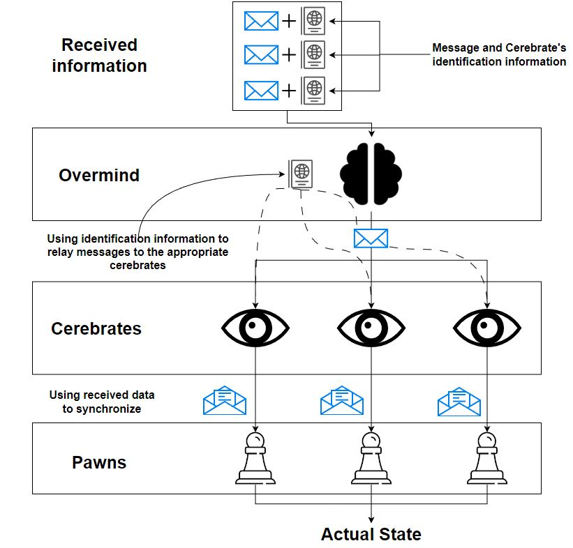
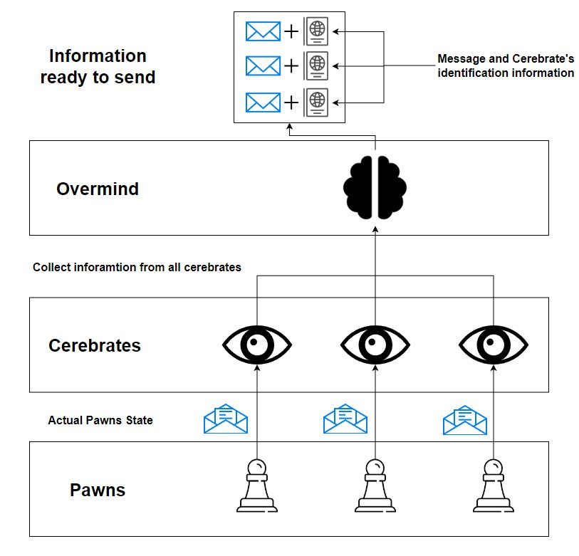
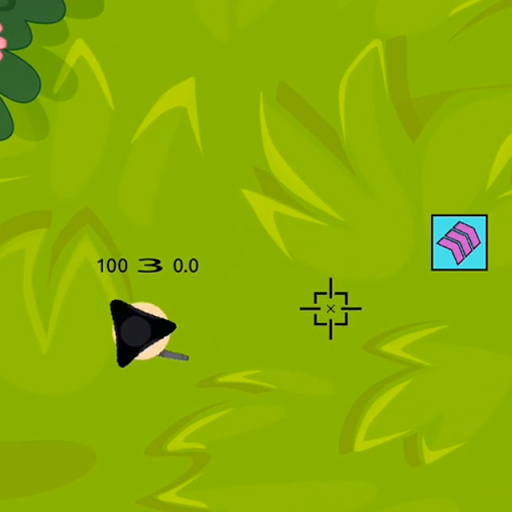
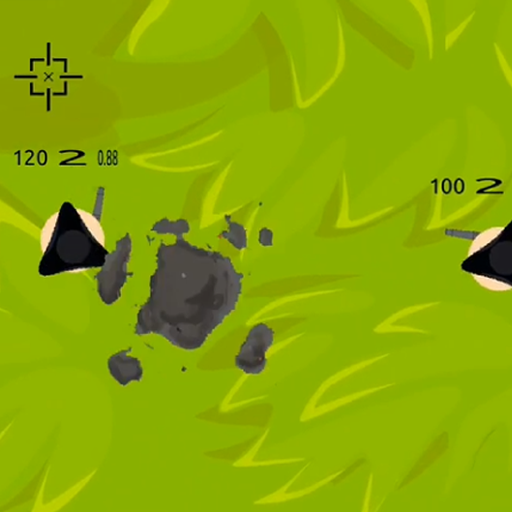
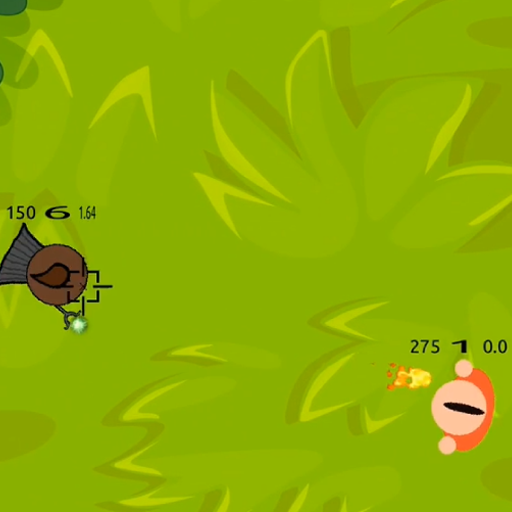
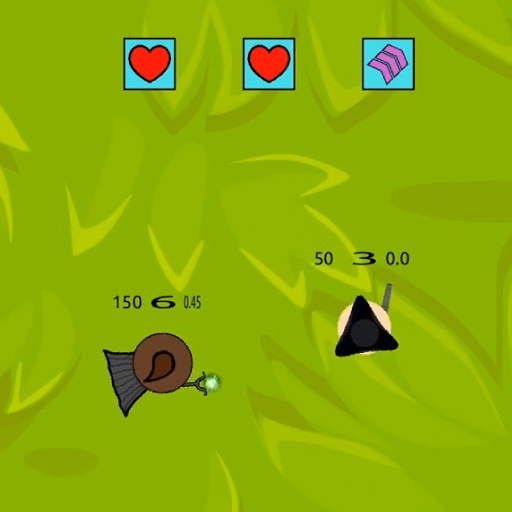

# Brawls 

Brawls is a simple multiplayer duel game with sprite-based 2D graphics. It's built using ```C++```, with ```Qt``` handling the graphics and ```Boost``` managing the networking. The game itself is based on custom game engine framework and replication system, which can be reused for a number of different projects.

The game has a client-server architecture. All gameplay logic is executed on a dedicated server, while game clients are responsible for visualizing the gameplay and handling player input.

In addition to standard keyboard and mouse controls, the game supports control by a third-party bot programs, which can be written in any programming language.


## Setup

The project can be built with ```CMake```. It is assumed that ```Qt5``` and ```Boost``` are already installed. To begin, you need to clone this repository and navigate to its root ```.../BrawsProject/```. Then, follow the standard command sequence:
  * Create a build directory: ```mkdir build```
  * Enter it: ```cd build```
  * Generate make files: ```cmake ..```
  * Build Client target: ```make Client```

Now, to play the game on a remote server, simply run the compiled program: ```./Client```.

If you want to run the game on your own server, follow these steps. Build the server target: ```make Server```. In the client source code, you need to change the default server IP to your server IP. To do so, you need to change the constant ```GAME_HOST``` in ```.../BrawsProject/src/NormInfrastructure/GameInfo.h```. Specifically, if you want to play the game locally, use ```localhost``` as the IP. Then rebuild the client: ```make Client```. To start the server, simply run the server program: ```./Server```. Once the server is running, you can run the clients and start playing. 

## Game engine

The game is based on our custom game engine framework. The engine is composed of several independent modules that perform various tasks and provides API for interacting with them, automating the process to the maximum extend. The functional components of the engine are: ```render```, ```collision system```, ```event system```, ```deferred function system``` and ```input system```.

The engine works with subclasses of the base class GameObject, which has:
  * A collider representing the "physical" part of the object
  * A visual component that will be rendered and seen on the screen during the game
  * A position determining the object's location in the game world
  * A special method ```OnUpdate```, specifying what should be done during each update of the game world

Thus, the main game code will look like

```cpp
#include <Core/Engine.h>
#include <Core/MyTime.h>

#define MAX_FPS 144

int main() {
    Engine& engine = Engine::GetInstance();
    // some game specific initialization
    MyTime timer;
    engine.SetActiveOn();
    while (engine.IsActive()) {
        timer.ResetTime();
        engine.Update();
        std::this_thread::sleep_for(1.0 / MAX_FPS - timer.EvaluateTime());
    }
    return 0;
}
```

And to construct the game logic, you only need to override the ```OnUpdate``` method in your game classes.

## Replication

To create a multiplayer game, it's necessary to synchronize clients and replicate the current game state between them. In this project, this is achieved using our ```SwarmSystem```.

The idea of the SwarmSystem is as follows: each game object that needs to be replicated has an associated entity called ```Cerebrate```. These Cerebrates know how to gather the current object's state and, upon receiving new state information, apply it to the object. In the SwarmSystem, there is a central entity called ```Overmind```, which queries these entities, collects the information from them, assembles resulting data for network transmission, and, upon receiving new information over the network, distributes the information to the Cerebrates, instructing them on what to do. This architecture is reminiscent of how the Zerg Swarm is organized is StarCraft, hence the names. 
A significant advantage of this system is that it is isolated from the game logic.

Here is a diagram showing how exactly SwarmSystem performs synchronization:

Receiving side             |  Sending side
:-------------------------:|:-------------------------:
  |  

By using SwarmSystem in conjuction with the game engine described above, it's possible to create various multiplayer games. When SwarmSystem is used with the engine, the main code looks like the following:

**Client side**:
```cpp
#include <Core/Engine.h>
#include <Core/MyTime.h>
#include <SwarmSystem/Overmind.h>

#define MAX_FPS 144

int main() {
    Engine& engine = Engine::GetInstance();
    Overmind& overmind = Overmind::GetInstance();
    // some game specific initialization
    MyTime timer;
    engine.SetActiveOn();
    while (engine.IsActive()) {
        timer.ResetTime();
        auto data = ReceivePackage(); // receive from network
        overmind.ExecuteCommands(data);
        engine.Update();
        auto to_send = GetPreparedInput();
        SendPackage(to_send); // send using network
        std::this_thread::sleep_for(1.0 / MAX_FPS - timer.EvaluateTime());
    }
    return 0;
}
```
**Server side**:
```cpp
#include <Core/Engine.h>
#include <Core/MyTime.h>
#include <SwarmSystem/Overmind.h>

#define MAX_FPS 144

int main() {
    Engine& engine = Engine::GetInstance();
    Overmind& overmind = Overmind::GetInstance();
    // some game specific initialization
    MyTime timer;
    engine.SetActiveOn();
    while (engine.IsActive()) {
        timer.ResetTime();
        auto data = ReceivePackage(); // receive from network
        HandleInput(data);
        engine.Update();
        overmind.PrepareInformation();
        auto to_send = overmind.GetInfoSerialized();
        SendPackage(to_send); // send using network
        std::this_thread::sleep_for(1.0 / MAX_FPS - timer.EvaluateTime());
    }
    return 0;
}
```

## Bots

The game allows control by a third-party bot program, written in any language. To minimize the knowlegde threshold required for users to write a bot, the game utilizes ```input-output redirection```. From the bot developer's perspective, their program continuosly receives certain pre-defined format data on the standard input (```stdin```). When the program outputs something to the standard output (```stdout```), the game interprets it as the user's input. Thus, the bot developers only need to parse the game information sent to their bots and implement their bots' behaviour logic. To switch control to the bot, the player only needs to select bot control in the game settings and specify the path to the bot's executable file.


## Gameplay

Some screenshots of the game graphics:
|  |  |
|--|--|
 | 
 | 

Two characters appear at opposite ends of the map at the beginning of the match. There are various boosters scattered across the game arena. Additionally, the arena features different obstacles, shelters, and destructible objects. Over time, the arena boundaries start to constrict, forcing the characters closer to each other.

Character attacks inflict damage on other characters. Each character has a limited number of attacks, but they recharge over time if the player refrains from attacking. Character health slowly regenerates if they avoid taking damage for a certain period. The last surviving player wins the match.
